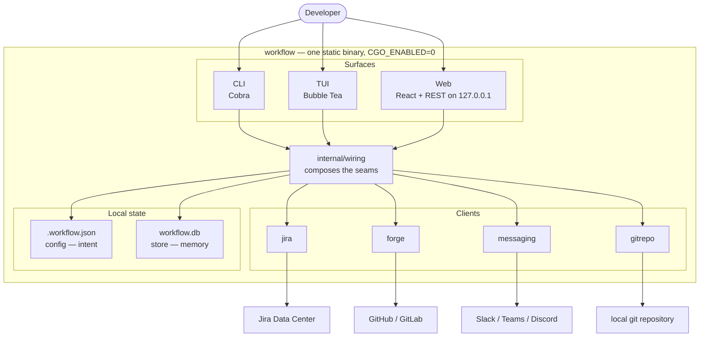
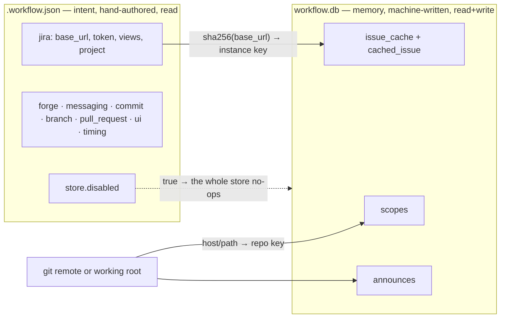
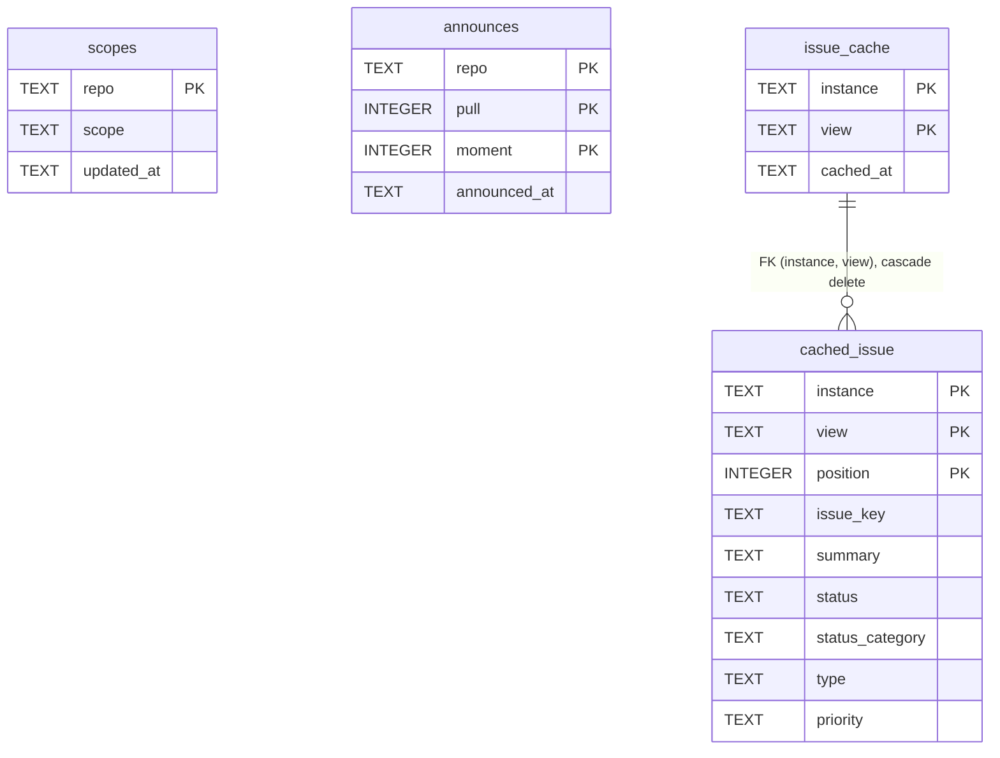
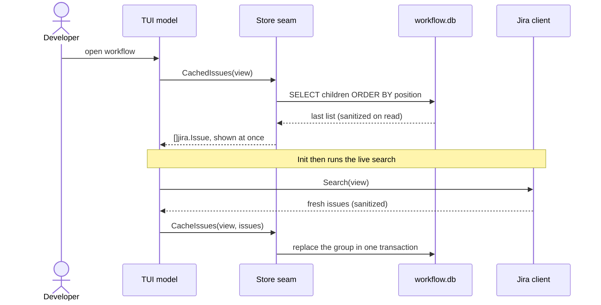

# Architecture

This document is the map of `workflow` — what the pieces are, how they fit, and
why the two kinds of local state (the `.workflow.json` **config** and the
`workflow.db` **store**) are separate. It is the orientation a newcomer reads
before the code; `CLAUDE.md` holds the day-to-day rules for changing it.

## What it is

`workflow` ties Jira (Data Center / on-premises), a team chat, and a Git forge
(GitHub or GitLab) into one developer loop: pick up an issue, branch for it by
convention, open the pull or merge request, and tell the team. It ships as a
**single static binary** a developer runs on their own machine — built pure Go
(`CGO_ENABLED=0`) so it cross-compiles to five platforms — with **no server and
no service to run**. The only things it keeps between sessions are a config file
you author and a small state database it writes for itself.

## One core, three surfaces

Everything the tool can do is reached through three surfaces, and none of them
holds its own copy of the logic. They are all **consumers of the same seams**.

| Surface | Stack | How you reach it |
| --- | --- | --- |
| **TUI** (default) | Bubble Tea, Bubbles, Lip Gloss | bare `workflow` |
| **CLI** | Cobra command tree | `workflow <command>` |
| **Web** | React + TypeScript over a local REST API | `workflow --web` (serves `http://127.0.0.1:7000`) |

The web frontend lives in `web/` and is embedded into the binary at build time;
the REST surface it drives is described by `api/openapi.yaml`, the single source
both the Go server and the TypeScript client are generated from. The web app is
**a surface, not a second implementation** — it adapts the same seam bundle the
TUI and CLI use down to a narrower set and serves it over loopback.

## The seam in the middle: `internal/wiring`

The surfaces do not talk to Jira, the forge, or git directly. They talk to
**seams** — small function-valued dependencies — and `internal/wiring` is the one
place those seams meet the real clients. This is dependency inversion in the
plain Go form the codebase prefers: a one-method dependency is a function
variable, not an interface.

`wiring.Deps(ctx, cfg, where, log)` returns a `tui.Deps` bundle. It composes one
grouped seam per external system (`Jira`, `Git`, `Forge`, `Messaging`, `Hooks`,
`Editor`, `Store`) plus a few environment seams (`Clock`, `CIInterval`, `Notify`,
`OpenURL`, `Copy`). Each grouped seam is a struct of closures that capture the
context and the resolved credential, so the TUI model itself never holds either —
which is exactly what lets its tests hand it canned answers with no network.

- `Workspace{Root, Remote}` tells wiring where it is running — the repository
  root (or the start directory when there is no repo) and the origin remote URL.
  It is discovered once, up front, by `Locate`.
- The CLI builds this bundle once in its root `RunE`; `--web` reuses **the same
  bundle**, adapted to the web server's shape. That shared construction is why
  there is one implementation behind three front doors.

A seam speaks the interface's own domain types, and wiring translates at the
boundary. The store seam is the clearest example: the TUI's `StoreDeps.CachedIssues`
returns `[]jira.Issue`, while the store on disk speaks its own decoupled
`store.CachedIssue`. Wiring converts between them — and runs every field through
`internal/sanitize` on the way through, because bytes read back from disk are
untrusted input to a terminal (more below).

## The clients

Each client is one cohesive responsibility behind a small API. They share one
HTTP transport and one subprocess seam.

| Package | Responsibility |
| --- | --- |
| `internal/jira` | Jira Data Center REST v2 — search, read, transition, comment, link a PR, whoami |
| `internal/forge` | GitHub / GitLab — remotes, tokens, pull/merge requests, CI status, review requests, forge-native issues |
| `internal/messaging` | Team announcements — Slack (bot token or webhook), Teams, Discord, plain webhook |
| `internal/httpx` | The shared one-method `Doer` seam and a **redirect-refusing** HTTP client |
| `internal/gitrepo` | Reads and changes the repository through git, via a caller-supplied `Runner` |
| `internal/proc` | The one place a subprocess is spawned |
| `internal/store` | The on-disk state database (this document's second half) |

The `messaging` package was formerly `slack`; the `slack` **kind** and the Slack
bot token remain first-class within it, but the package and its transport errors
are now service-neutral.

## Two kinds of local state, and why they are separate

`workflow` persists two things on disk, and keeping them apart is a deliberate
design line, not an accident of history. One is **intent you author**; the other
is **memory the tool writes for itself**.

### The config file — `.workflow.json`

The config is the user's declared intent: which Jira instance and views, which
forge, how to shape a branch name and a commit, which chat to post to, and their
credentials. It is **read, essentially never written** — the only writers are
`workflow config init` and the web's `PUT /api/config`, and that write always
goes to the server-fixed path, never one a request supplies.

- **Sections** (top-level JSON keys): `version`, `jira`, `messaging`, `forge`,
  `ui`, `timing`, `branch`, `commit`, `pull_request`, `store`.
- **Discovery and precedence**: `config.Load(workDir, homeDir)` looks in the
  working tree first — walking **up to the repository root** (the directory
  holding `.git`), never past it — and then in the home directory. A repo-local
  file **replaces** the home file; the two are not merged, so what a repo
  declares is exactly what that repo gets.
- **Strictness**: the decoder rejects unknown keys, so a misspelled field is an
  error rather than a silently unset credential; the file is decoded *over* the
  defaults, so an omitted field keeps its default. A short validation chain
  (version, timing, branch, views, commit, pull-request) runs on load, and every
  error path still returns usable defaults so a surface can open and explain the
  problem.
- **Secrets never leak**: `Config.Redacted()` masks every token, every extra
  header value, the webhook URL, and any credential in a URL's userinfo before
  the config is shown, logged, or rendered — keeping only a token's last four
  characters. Redaction is the plan; `gitleaks` is the backstop.

### The store — `workflow.db`

The store is what lets the tool feel like it remembers you: the scope you last
committed under here, which pull requests you have already announced, and the
last issue list it saw (so the first pane paints instantly, before the live
search returns). It is a SQLite database (`modernc.org/sqlite`, pure Go) under
the OS-native data directory:

- macOS — `~/Library/Application Support/workflow`
- Linux — `$XDG_STATE_HOME/workflow`, else `~/.local/state/workflow`
- Windows — `%AppData%\workflow`

It is **on by default**; `store.disabled: true` in the config turns it off, and
with it off the code path is identical to having no store at all — a disabled
store no-ops every method, so the "nothing kept between sessions" behavior is
still one flag away. The directory is `0700` and the file `0600`.

Two invariants make the store safe to keep unencrypted:

1. **It never holds a secret.** It is keyed only by credential-free identifiers.
   The repository key is the remote's parsed **host and path** (so clones of the
   same repo share state) — parsed, never taken raw, precisely so a credential
   embedded in an HTTPS remote's userinfo cannot reach the file. The Jira
   instance key is a **SHA-256 of the base URL**, never the URL itself.
2. **What it holds is disposable.** The issue cache is a convenience; losing it
   costs one live fetch. No feature depends on the store being present or
   truthful — which is what makes trusting-nothing-on-read (below) a safe stance
   rather than a broken one.

## The store schema

The schema is **Third Normal Form**, every table is **`STRICT`**, and it is the
worked example of the database rules in `CLAUDE.md`. Read the authoritative
column list in `internal/store/store.go`; the diagram below is the shape.

- **`scopes`** — the commit scope last used per repository, so the commit form
  pre-fills what you last chose over the configured default.
- **`announces`** — one row per `(repo, pull, moment)`, so a previously-announced
  pull request still shows as posted after a restart. No chat is read back; the
  tool records only its own posts.
- **`issue_cache` + `cached_issue`** — the repeating group done in normal form.
  A **cached issue list is not a JSON blob in one cell** (a list in a cell fails
  1NF, and so 3NF); it is a parent `issue_cache` row per view — which also lets a
  view that returned *no* issues be recorded as "cached but empty", distinct from
  "never cached" — and one ordered `cached_issue` child per issue.

Three rules from `CLAUDE.md` are visible in the schema:

- **`STRICT` tables** enforce each column's declared type at write time, so
  garbage cannot land through SQLite's default coercion.
- **Timestamps are RFC3339 UTC text** in `_at` columns — never `DATETIME` or
  `CURRENT_TIMESTAMP` (a `STRICT` table has no date type), and the moment is a
  passed-in `now`, keeping the clock a testable seam.
- **Referential integrity is enforced**: the connection sets
  `PRAGMA foreign_keys=ON` (SQLite honors `ON DELETE CASCADE` only per-connection
  when it is on), the child cascades from its parent, and a re-cache **replaces
  the whole group in one transaction** — upsert the parent, delete the children,
  insert the new ones — so a view is never left half-updated.

Migrations are forward-only and idempotent (every open runs them); pre-1.0 there
are no migration shims for the unreleased schema.

## Trust boundaries and data flow

Two sources of bytes are treated as untrusted: **the network** (issue summaries,
PR titles, authors — attacker-influenceable text) and **the disk** (the store is
a file outside our process that could be tampered with). Neither is allowed to
carry a terminal control sequence into the TUI or an unescaped string into an
announcement. Text is sanitized through `internal/sanitize` on the way in as
defense in depth, and again at the seam that renders it on the way out.

The instant-start flow shows both the caching and that read boundary:

## Security posture

The tool handles credentials and runs on a developer's machine, so a few seams
exist only to hold a line:

- **No redirects follow a credentialed request.** `internal/httpx` uses a client
  whose `CheckRedirect` always refuses, because Go's default client forwards the
  `Authorization` header to any redirect target on the same hostname — ignoring
  port and scheme — so an HTTPS→HTTP redirect on the same host would leak the
  token to a plaintext hop.
- **The web server is loopback-only and guarded.** It binds `127.0.0.1:7000`,
  rejects any request whose `Host` is not a loopback host (closing DNS-rebinding),
  requires a state-changing request that carries an `Origin` to be same-origin
  (closing cross-origin CSRF from a co-resident page), and — under `--dry-run` —
  refuses every write at one gate, making the whole surface read-only. There is
  no auth scheme, by design: a single local user over loopback.
- **Secrets are masked before any output** and are never written to the store;
  the token no-leak tests ship with any change that touches a credential path.
- **Web API errors leak nothing.** Every error a handler returns is an RFC 9457
  problem details object (`application/problem+json`) whose `detail` is curated: it
  never carries a secret or an internal host — an unreachable upstream is
  genericized because its error names the host — though a write's refusal may
  carry the git or forge's own reason. See
  [Web API errors](https://jacob-delgado.github.io/workflow/docs/errors/).
- **One subprocess seam.** `internal/proc` is the only place the module spawns a
  program, which is where the exec-safety exception is concentrated rather than
  scattered.

## Where to look next

- `CLAUDE.md` — the rules for changing this code, including the full database
  standards and the package-size and file-length budgets.
- `api/openapi.yaml` — the REST contract; the Go server and TS client are
  generated from it, and `task gen:verify` fails CI on drift.
- `internal/wiring/wiring.go` — the one place the seams meet the clients.
- `internal/store/store.go` — the authoritative schema.
