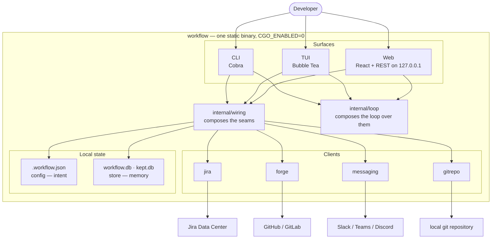
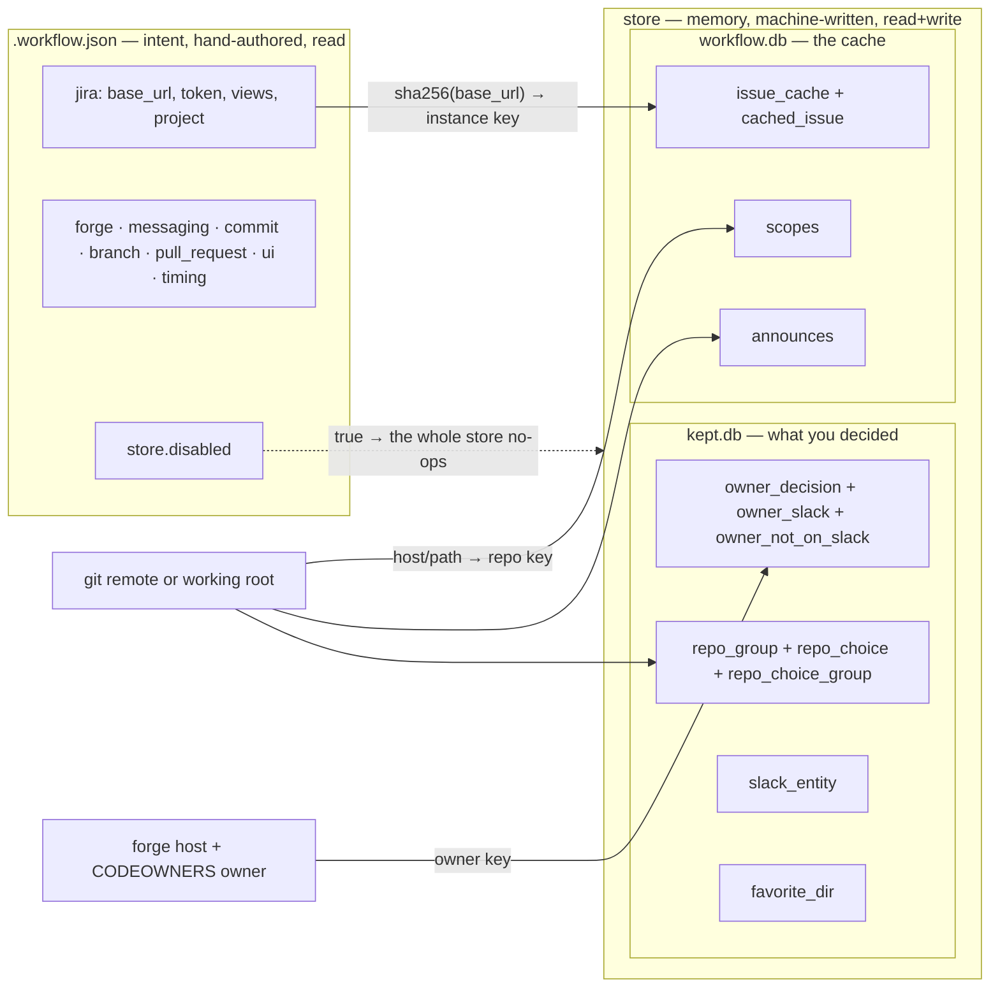
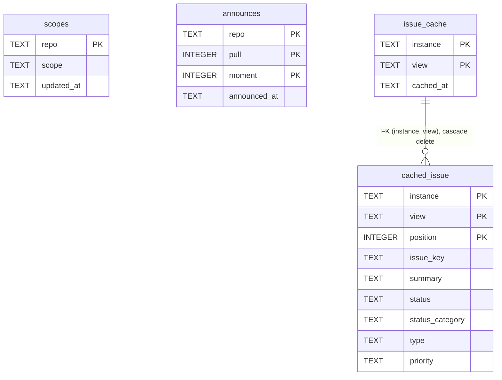
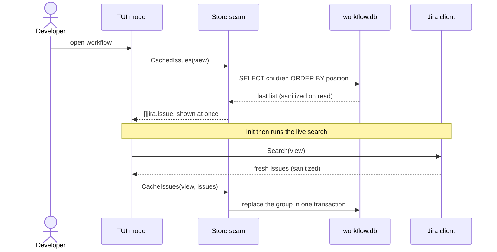

# Architecture

This document is the map of `workflow` — what the pieces are, how they fit, and
why the two kinds of local state (the `.workflow.json` **config** and the
**store**, `workflow.db` and `kept.db`) are separate. It is the orientation a
newcomer reads before the code; `CLAUDE.md` holds the day-to-day rules for
changing it.

## What it is

`workflow` ties Jira (Data Center / on-premises), a team chat, and a Git forge
(GitHub or GitLab) into one developer loop: pick up an issue, branch for it by
convention, open the pull or merge request, and tell the team. It ships as a
**single static binary** a developer runs on their own machine — built pure Go
(`CGO_ENABLED=0`) so it cross-compiles to every platform `RELEASE_PLATFORMS`
names in `Taskfile.yml` — with **no server and no service to run**. The only
things it keeps between sessions are a config file you author and two small
state databases it writes for itself: `workflow.db`, a cache, and `kept.db`,
what you decided.

## One core, three surfaces

Everything the tool can do is reached through three surfaces, and none of them
holds its own copy of the logic. They are all **consumers of the same seams**.

| Surface | Stack | How you reach it |
| --- | --- | --- |
| **TUI** (default) | Bubble Tea, Bubbles, Lip Gloss | bare `workflow` |
| **CLI** | Cobra command tree | `workflow <command>` |
| **Web** | React + TypeScript over a local REST API | `workflow --web` (serves `http://127.0.0.1:13579`) |

The web frontend lives in `web/` and is embedded into the binary at build time;
the REST surface it drives is described by `api/openapi.yaml`, the single source
both the Go server and the TypeScript client are generated from. The web app is
**a surface, not a second implementation** — it adapts the same seam bundle the
TUI and CLI use down to a narrower set and serves it over loopback.

```mermaid
flowchart TB
    dev(["Developer"])

    subgraph binary["workflow — one static binary, CGO_ENABLED=0"]
        direction TB
        subgraph surfaces["Surfaces"]
            cli["CLI<br/>Cobra"]
            tui["TUI<br/>Bubble Tea"]
            web["Web<br/>React + REST on 127.0.0.1"]
        end
        wiring["internal/wiring<br/>composes the seams"]
        loop["internal/loop<br/>composes the loop over them"]
        subgraph clients["Clients"]
            jira["jira"]
            forge["forge"]
            msg["messaging"]
            git["gitrepo"]
        end
        subgraph localstate["Local state"]
            cfg[".workflow.json<br/>config — intent"]
            store["workflow.db · kept.db<br/>store — memory"]
        end
    end

    dev --> cli & tui & web
    cli & tui & web --> wiring
    cli & tui & web --> loop
    wiring --> jira & forge & msg & git
    wiring --> cfg & store
    jira --> jiraSrv["Jira Data Center"]
    forge --> forgeSrv["GitHub / GitLab"]
    msg --> chat["Slack / Teams / Discord"]
    git --> repo["local git repository"]
```

## The seam in the middle: `internal/wiring`

The surfaces do not talk to Jira, the forge, or git directly. They talk to
**seams** — small function-valued dependencies — and `internal/wiring` is the one
place those seams meet the real clients. This is dependency inversion in the
plain Go form the codebase prefers: a one-method dependency is a function
variable, not an interface.

`wiring.Deps(ctx, cfg, where, log)` returns a `tui.Deps` bundle and a
`resolveAhead` hook. It composes one grouped seam per external system (`Jira`,
`Git`, `Forge`, `Messaging`, `Hooks`, `Editor`, `Store`) plus a few environment
seams (`Clock`, `CIInterval`, `After`, `Notify`, `OpenURL`, `Copy`). Each
grouped seam is a struct of closures that capture the context and a
once-connected client. Jira, the messaging service and the forge each find their
token the first time a seam asks, and a failure is retried on the next ask
rather than remembered. So a command that never reaches a service never looks up
its token, and the TUI model itself never holds a credential — which is exactly
what lets its tests hand it canned answers with no network.

Every grouped seam but `Editor` is declared in `internal/seams` (`seams.Jira`,
`seams.Git`, `seams.Store` and the rest), over the domain packages' own types
and `loop.Announced`, so any surface can take one without importing the
terminal. The command line and the terminal take the bundles, and the web server
takes the same functions narrowed into a `webserver.Deps` by `cli.WebDeps`.
`Editor` speaks Bubble Tea's messages and commands, so it stays in `tui`, and
the bundle `wiring` returns is still a `tui.Deps`. The
`seams-below-the-surfaces` `depguard` rule in `.golangci.yml` allows
`internal/seams` only the domain packages and `internal/loop` its bundles speak,
so it sits below the surfaces and above `internal/loop`.

- `Workspace` tells wiring where it is running — the directory it was started
  in, the repository root (or that directory when there is no repo) and the
  origin remote URL. `Locate` reads it for a directory, once per interface.
- The CLI builds this bundle in its root `RunE`; `--web` reuses **the same
  bundle**, adapted to the web server's shape. That shared construction is one
  half of why there is one implementation behind three front doors;
  `internal/loop`, below, is the other. Before the interface or `--web` starts,
  the CLI calls `resolveAhead`, which looks up the Jira token in advance, so a
  token command that prompts on the terminal can be answered before either
  takes the terminal over. A token not found then is looked for again on first
  use, where its failure is reported.
- **Switching directory.** The Repositories pane's switch ends the running
  program with a `tui.Next` naming the directory; the CLI checks it, wires it
  through the same `connectAt` the first directory went through, refuses it if
  its `ui.keys` would be, and only then moves the process there and opens the
  next interface, handing it what of the session the switch carried. A switch
  that cannot be made reopens the interface where it was. So a bundle is still
  built once per interface, never rewired under a running one (TRADE-34).

A seam speaks the interface's own domain types, and wiring translates at the
boundary. The store seam is the clearest example: `seams.Store.CachedIssues`
returns `[]jira.Issue`, while the store on disk speaks its own decoupled
`store.CachedIssue`. Wiring converts between them — and runs every field through
`internal/sanitize` on the way through, because bytes read back from disk are
untrusted input to a terminal (more below).

## The loop, composed once: `internal/loop`

Seams say how to reach the world; they do not say what to do with it. What the
surfaces do with their seams — propose a pull request from a branch's commits,
its issue and the repository's template, push the branch before opening it,
find the move to the review status after, announce the pull request at the
moment it is at, and refuse a switch that would carry uncommitted work or a
commit with nothing staged — lives once, in `internal/loop`, rather than once
per surface. The terminal already holds the facts an announcement and a pull
request's proposal are made from, so it hands them to the value-level
`loop.Announcement` and `loop.Draft` rather than have `loop` read them again
through seams; the command line and the web keep `loop.ComposeAnnouncement` and
`loop.ComposePull`, which read them through seams and delegate to those two. The
terminal posts an announcement and remembers it through `loop.Deliver`, as the
command line does; the web does not yet remember what it announced.

Each surface hands `loop` the seams it holds and words the answer in its own
terms: a refusal comes back as a `loop.Err…` sentinel, and the command line,
the terminal and the web server each map it to the sentence they already use
(`errors.Is` at the surface), so the shared layer never dictates one surface's
wording to another.

`internal/loop` is a leaf above the domain packages and below the surfaces. It
imports only the domain packages the `loop-below-the-surfaces` rule in
`.golangci.yml` lists, and is imported by `cli`, `seams`, `tui`, `webserver`
and `wiring`. It cannot live in `wiring`, which imports `tui` for `tui.Deps`
(the terminal importing it back would be a cycle), nor in `tui`, which the web
server must not import, nor in `convention`, which `config` imports and so can
never take a `config.Config`. Two `depguard` rules in `.golangci.yml` hold its
direction: `loop-below-the-surfaces` allows `internal/loop` only that list,
and `webserver-not-terminal` keeps the web server off `tui` and `wiring`.

The composition that belongs to a single domain type lives on that type
instead: the forge's noun and number sigil are `forge.Kind.Noun()` and
`Sigil()`, and branch naming is `config.Branch.Naming()`.

## The clients

Each client is one cohesive responsibility behind a small API. They share one
HTTP transport and one subprocess seam.

| Package | Responsibility |
| --- | --- |
| `internal/jira` | Jira Data Center REST v2 — search, read, transition, comment, assign, log work, link a PR, whoami, Markdown to wiki markup |
| `internal/forge` | GitHub / GitLab — remotes, tokens, pull/merge requests and their templates, CI status, review requests, forge-native issues |
| `internal/messaging` | Team announcements — Slack (rotating user token or webhook), Teams, Discord, plain webhook |
| `internal/slackauth` | Keeps a Slack user token posting: refreshes it, keeps each pair in the keychain or the file, under a lock |
| `internal/httpx` | The shared one-method `Doer` seam and a **redirect-refusing** HTTP client |
| `internal/gitrepo` | Reads and changes the repository through git, via a caller-supplied `Runner` |
| `internal/taskwarrior` | Your Taskwarrior tasks — read them, change them, and the Tasks list's orders and narrowing |
| `internal/proc` | The one place a subprocess is spawned |
| `internal/store` | The on-disk state databases, `workflow.db` and `kept.db` (this document's second half) |

The `messaging` package was formerly `slack`; the `slack` **kind** and the Slack
user token remain first-class within it, but the package and its transport errors
are now service-neutral.

## Two kinds of local state, and why they are separate

`workflow` persists two things on disk, and keeping them apart is a deliberate
design line, not an accident of history. One is **intent you author**; the other
is **memory the tool writes for itself**.

```mermaid
flowchart LR
    subgraph config[".workflow.json — intent, hand-authored, read"]
        direction TB
        jiraCfg["jira: base_url, token, views, project"]
        rest["forge · messaging · commit · branch · pull_request · ui · timing"]
        storeCfg["store.disabled"]
    end
    subgraph store["store — memory, machine-written, read+write"]
        direction TB
        subgraph cachedb["workflow.db — the cache"]
            scopes["scopes"]
            announces["announces"]
            cache["issue_cache + cached_issue"]
        end
        subgraph keptdb["kept.db — what you decided"]
            owners["owner_decision + owner_slack + owner_not_on_slack"]
            groups["repo_group + repo_choice + repo_choice_group"]
            labels["slack_entity"]
            favorites["favorite_dir"]
        end
    end
    src["git remote or working root"]
    codeowners["forge host + CODEOWNERS owner"]

    jiraCfg -->|"sha256(base_url) → instance key"| cache
    src -->|"host/path → repo key"| scopes
    src --> announces
    src --> groups
    codeowners -->|"owner key"| owners
    storeCfg -. "true → the whole store no-ops" .-> store
```

### The config file — `.workflow.json`

The config is the user's declared intent: which Jira instance and views, which
forge, how to shape a branch name and a commit, which chat to post to, and their
credentials. It is **read, essentially never written** — the only writers are
`workflow config init` and the web's `PUT /api/config`, and that write always
goes to the server-fixed path, never one a request supplies.

- **Sections** (top-level JSON keys): `version`, `jira`, `messaging`, `forge`,
  `ui`, `timing`, `branch`, `commit`, `pull_request`, `store`.
- **Discovery and precedence**: `config.Load(workDir, homeDir)` looks in the
  working tree first — walking **up to the repository root** (the directory
  holding `.git`), never past it — and then in the home directory. The
  repository's file is **layered over** the home file: an object in both is
  merged key by key, and anything else the repository sets — a list, a string,
  an explicit `false` — replaces the home file's. A section the repository
  points somewhere else inherits none of the home file's credentials for it.
- **Strictness**: the decoder rejects unknown keys, so a misspelled field is an
  error rather than a silently unset credential; the file is decoded *over* the
  defaults, so an omitted field keeps its default. A short validation chain
  (version, timing, branch, views, commit, pull-request) runs on load, and every
  error path still returns usable defaults so a surface can open and explain the
  problem.
- **Secrets never leak**: `Config.Redacted()` masks every token, every extra
  header value, the webhook URL, and any credential in a URL's userinfo before
  the config is shown, logged, or rendered — keeping only a token's last four
  characters. Redaction is the plan; `gitleaks` is the backstop.

### The store — `workflow.db` and `kept.db`

The store is what lets the tool feel like it remembers you. `workflow.db` is
the cache: the scope you last committed under here, which pull requests you have
already announced, and the last issue list it saw (so the first pane paints
instantly, before the live search returns). `kept.db`, beside it, holds what the
user decided and cannot be seen again: whom a forge owner is on Slack, a
repository's groups, the favorite directories. Both are SQLite databases
(`modernc.org/sqlite`, pure Go) under the OS-native data directory:

- macOS — `~/Library/Application Support/workflow`
- Linux — `$XDG_STATE_HOME/workflow`, else `~/.local/state/workflow`
- Windows — `%AppData%\workflow`

It is **on by default**; `store.disabled: true` in the config turns it off, and
with it off the code path is identical to having no store at all — a disabled
store no-ops every method, so the "nothing kept between sessions" behavior is
still one flag away. Where the filesystem keeps Unix modes, the directory is
`0700` and each file in it `0600`, set on every open so that a directory which
already existed is narrowed too.

A `--dry-run` never makes either file or changes what one holds. The interface
and `--web` read nothing from the cache — Local data still counts what each
file holds — and read `kept.db` read-only when it is already there, for the
owner links, groups and favorites; a command reads the file it needs the same
way, and only when it is there. A dry run reads `workflow.db` as it is,
whichever build made it, and a `kept.db` another build's schema made as empty.
Like any reader of a write-ahead-logged database, SQLite may leave the two
owner-only companion files of the file it read — `kept.db-wal` and
`kept.db-shm` after a read of `kept.db`, `workflow.db-wal` and
`workflow.db-shm` after one of `workflow.db` — until the next live open of that
file removes them.

Three invariants make the store safe to keep unencrypted and to distrust on
read:

1. **It never holds a secret.** Neither file is keyed by anything but
   credential-free identifiers. The repository key, which keys `workflow.db`'s
   scopes and announcements and `kept.db`'s groups, is the remote's parsed
   **host and path** (so clones of the same repo share state) — parsed, never
   taken raw, precisely so a credential embedded in an HTTPS remote's userinfo
   cannot reach the file — or the repository's **root path** when there is no
   remote or it does not parse. The Jira instance key is a **SHA-256 of the
   base URL**, never the URL itself, and the issue cache is keyed by it and by
   the **view's JQL** query. In `kept.db`, an owner is keyed by the **forge's
   host and the owner's name**, each Slack link, not-on-Slack mark and group
   also by the **Slack workspace ID** it belongs to, and a favorite by its
   **path**.
2. **What `workflow.db` holds is disposable.** The issue cache is a convenience;
   losing it costs one live fetch, and a file another build's schema made is
   discarded and made again. No feature depends on the cache being present or
   truthful — which is what makes trusting-nothing-on-read (below) a safe stance
   rather than a broken one.
3. **What `kept.db` holds is kept, and still not trusted.** It is what the user
   decided and a session cannot see again, so it is never discarded: a file
   another build's schema made is left as it is, reads as empty, and refuses
   every write with `ErrKeptSchemaDiffers`, which names
   `workflow db-clean --all`. Trusting nothing on read stays safe here because
   a row it cannot trust costs a choice made again rather than a failure: a
   row of the wrong shape is left out. The people or group association it held
   reads as never made, which workflow asks for again; a favorite directory
   reads as never marked, which workflow never asks about, so it stays off the
   list until you mark it again.

## The store schema

Both files' schemas are **Third Normal Form**, every table is **`STRICT`**, and
they are the worked example of the database rules in `CLAUDE.md`. The diagram
below is `workflow.db`'s shape; read its authoritative column list in
`internal/store/store.go`. `kept.db`'s tables are `keptSchema` in
`internal/store/kept.go`, which joins `ownersSchema`, `groupsSchema` and
`favoritesSchema` from `owners.go`, `groups.go` and `favorites.go`.

```mermaid
erDiagram
    scopes {
        TEXT repo PK
        TEXT scope
        TEXT updated_at
    }
    announces {
        TEXT repo PK
        INTEGER pull PK
        INTEGER moment PK
        TEXT announced_at
    }
    issue_cache ||--o{ cached_issue : "FK (instance, view), cascade delete"
    issue_cache {
        TEXT instance PK
        TEXT view PK
        TEXT cached_at
    }
    cached_issue {
        TEXT instance PK
        TEXT view PK
        INTEGER position PK
        TEXT issue_key
        TEXT summary
        TEXT status
        TEXT status_category
        TEXT type
        TEXT priority
    }
```

- **`scopes`** — the commit scope last used per repository, so the commit form
  pre-fills what you last chose over the configured default.
- **`announces`** — one row per `(repo, pull, moment)`, so a previously-announced
  pull request still shows as posted after a restart. No chat is read back; the
  tool records only its own posts.
- **`issue_cache` + `cached_issue`** — the repeating group done in normal form.
  A **cached issue list is not a JSON blob in one cell** (a list in a cell fails
  1NF, and so 3NF); it is a parent `issue_cache` row per view — which also lets a
  view that returned *no* issues be recorded as "cached but empty", distinct from
  "never cached" — and one ordered `cached_issue` child per issue.

Three rules from `CLAUDE.md` are visible in the schema:

- **`STRICT` tables** enforce each column's declared type at write time, so
  garbage cannot land through SQLite's default coercion.
- **Timestamps are RFC3339 UTC text** in `_at` columns — never `DATETIME` or
  `CURRENT_TIMESTAMP` (a `STRICT` table has no date type), and the moment is a
  passed-in `now`, keeping the clock a testable seam.
- **Referential integrity is enforced**: a writing connection sets
  `PRAGMA foreign_keys=ON` (SQLite honors `ON DELETE CASCADE` only per-connection
  when it is on), the child cascades from its parent, and a re-cache **replaces
  the whole group in one transaction** — upsert the parent, delete the children,
  insert the new ones — so a view is never left half-updated.

`workflow.db`'s schema has one version, `schemaVersion`, stamped into the file
as `PRAGMA user_version` by the open that makes the file, before its first
table; a file at another version that holds tables is discarded with its `-wal`
and `-shm` companions and made again, since nothing the cache keeps is worth
carrying across a schema change. `kept.db`'s schema also has one version,
`keptSchemaVersion` in `internal/store/kept.go`, made and stamped in one
`BEGIN IMMEDIATE` transaction that re-reads it; a file at another version is
never discarded — it reads as empty and refuses writes with
`ErrKeptSchemaDiffers`, naming `workflow db-clean --all`. A `--dry-run`
command's read-only open stamps neither file: it reads `workflow.db` as it is,
whichever build made it, and a `kept.db` another build's schema made as empty.
There are no migrations: a schema change is a `CREATE TABLE` edit and a bump of
that file's version, and a `schemaVersion` bump never touches `kept.db`.

## Trust boundaries and data flow

Two sources of bytes are treated as untrusted: **the network** (issue summaries,
PR titles, authors — attacker-influenceable text) and **the disk** (the store's
two files are outside our process and could be tampered with). Neither is
allowed to carry a terminal control sequence into the TUI or an unescaped string
into an announcement. Text is sanitized through `internal/sanitize` on the way
in as defense in depth, and again at the seam that renders it on the way out.

The instant-start flow shows both the caching and that read boundary:

```mermaid
sequenceDiagram
    actor U as Developer
    participant T as TUI model
    participant S as Store seam
    participant DB as workflow.db
    participant J as Jira client

    U->>T: open workflow
    T->>S: CachedIssues(view)
    S->>DB: SELECT children ORDER BY position
    DB-->>S: last list (sanitized on read)
    S-->>T: []jira.Issue, shown at once
    Note over T,J: Init then runs the live search
    T->>J: Search(view)
    J-->>T: fresh issues (sanitized)
    T->>S: CacheIssues(view, issues)
    S->>DB: replace the group in one transaction
```

## Security posture

The tool handles credentials and runs on a developer's machine, so a few seams
exist only to hold a line:

- **No redirects follow a credentialed request.** `internal/httpx` uses a client
  whose `CheckRedirect` always refuses, because Go's default client forwards the
  `Authorization` header to any redirect target on the same hostname — ignoring
  port and scheme — so an HTTPS→HTTP redirect on the same host would leak the
  token to a plaintext hop.
- **The web server is loopback-only and guarded.** It binds `127.0.0.1`
  alone, on port 13579 unless `--port` names another, rejects any request
  whose `Host` is not a loopback host (closing DNS-rebinding), requires a
  state-changing request that carries an `Origin` to be same-origin (closing
  cross-origin CSRF from a co-resident page), and — under `--dry-run` —
  refuses every write at one gate, making the whole surface read-only. Every
  API request must also present the run's session, a secret each run makes as
  it starts and gives its page in the address it prints, so a program on the
  machine that was never shown that address cannot drive the API. Beyond that
  there are no accounts or logins, by design: a single local user over
  loopback.
- **Secrets are masked before any output** and are never written to the store;
  the token no-leak tests ship with any change that touches a credential path.
- **Web API errors leak nothing.** Every error a handler returns is an RFC 9457
  problem details object (`application/problem+json`) whose `detail` is curated: it
  never carries a secret or an internal host — an unreachable upstream is
  genericized because its error names the host — though a write's refusal may
  carry the git or forge's own reason. See
  [Web API errors](https://jacob-delgado.github.io/workflow/docs/errors/).
- **One subprocess seam.** `internal/proc` is the only place the module spawns a
  program, which is where the exec-safety exception is concentrated rather than
  scattered.

## Where to look next

- `CLAUDE.md` — the rules for changing this code, including the full database
  standards and the package-size and file-length budgets.
- `api/openapi.yaml` — the REST contract; the Go server and TS client are
  generated from it. `task gen:verify` fails when the Go code drifts from it
  and `task web:gen:check` when the TypeScript client does; CI runs both.
- `internal/wiring/wiring.go` — the one place the seams meet the clients.
- `internal/store/store.go` — `workflow.db`'s authoritative schema, and
  `internal/store/kept.go` — `kept.db`'s.
